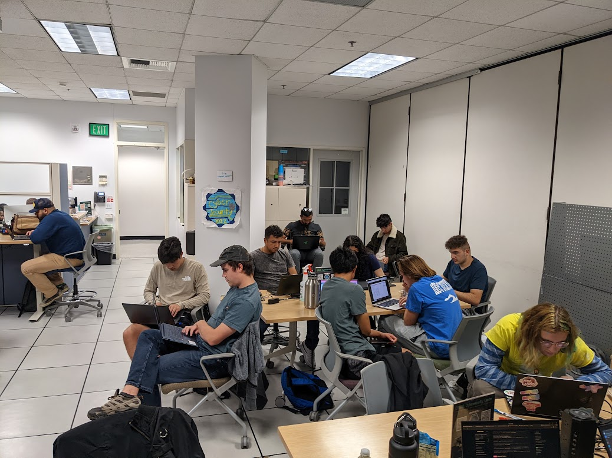
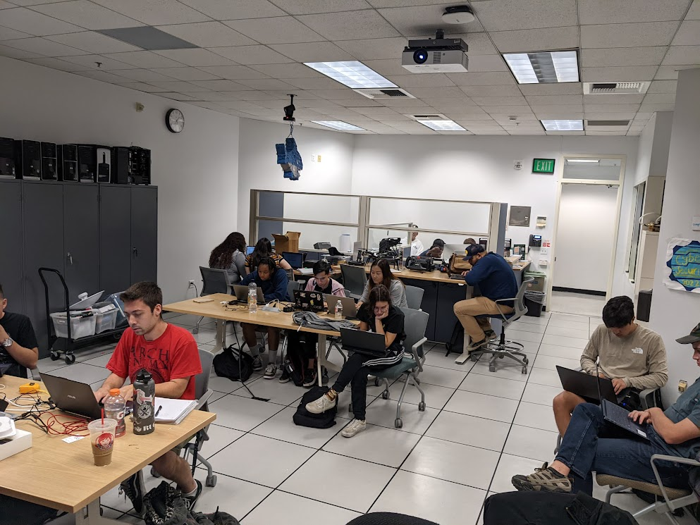

# Incident Responder
## Subproject Splunk with Caldera

In this subproject students are expected to find and interrogate maliscious actions generated by Caldera with only Splunk

## Day of the hunt!

.............

